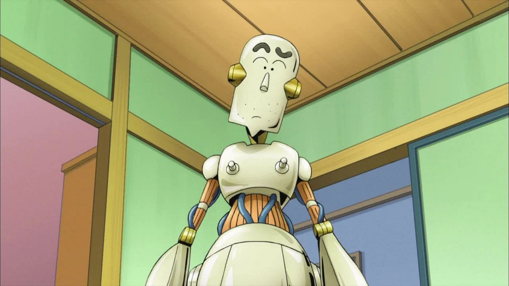

<!-- ================= TITLE BLOCK ================= -->
<h1 align="center" style="color:#00FFD1;">
🤖 Shichan Robo Dad – ASCII Art Project
</h1>

<p align="center">
  
  
  
</p>

---

<!-- ================= CAPTION BLOCK ================= -->
<div style="background-color:#0d1117; padding:15px; border-radius:10px;">
  <h3 style="color:#58a6ff;">📌 Project Caption</h3>
  <p style="color:#c9d1d9;">
    This project renders a large-scale <b>ASCII Art character</b> named
    <b>Shichan Robo Dad</b> directly in the terminal using Python.
  </p>
</div>

---

<!-- ================= IMAGE SECTION ================= -->
<h2 style="color:#ff7b72;">🖼️ Reference Input Image</h2>

<p align="center">
  
</p>

---

<h2 style="color:#ff7b72;">💻 Terminal Output Preview</h2>

<p align="center">
  
</p>

---

<!-- ================= STRUCTURE ================= -->
<h2 style="color:#d2a8ff;">📁 Project Structure</h2>

```text
minor-ll/
│
├── ascii.py
├── README.md
└── mino-ll/
    ├── robo_dad_shichan.webp
    └── Screenshot 2026-01-09 103532.png
<!-- ================= RUN STEPS ================= --> <h2 style="color:#7ee787;">🚀 How to Run</h2>
bash
Copy code
git clone https://github.com/rishika35-hub/minor-ll.git
cd minor-ll
python ascii.py
🟢 Python 3.10+ required
🟢 Works on Windows / Linux / macOS

<!-- ================= FEATURES ================= --> <h2 style="color:#ffa657;">✨ Features</h2>
Large scale ASCII art (100+ rows, 120 columns)

Detailed hair, eyes, nose & coat structure

Clean terminal rendering

Uses modern match-case syntax

Ideal for minor / academic projects

<!-- ================= TECHNOLOGY ================= --> <h2 style="color:#79c0ff;">🛠️ Technologies Used</h2>
Python 3.10+

ASCII Art

Nested loops

Terminal manipulation

<!-- ================= AUTHOR ================= --> <h2 style="color:#f0883e;">👩‍💻 Author</h2>
<b>Rishika</b>
🔗 GitHub: https://github.com/rishika35-hub

<div style="background-color:#161b22; padding:10px; border-radius:10px;" align="center"> <p style="color:#c9d1d9;"> ⭐ If you like this project, don't forget to star the repository! </p> </div> ```
